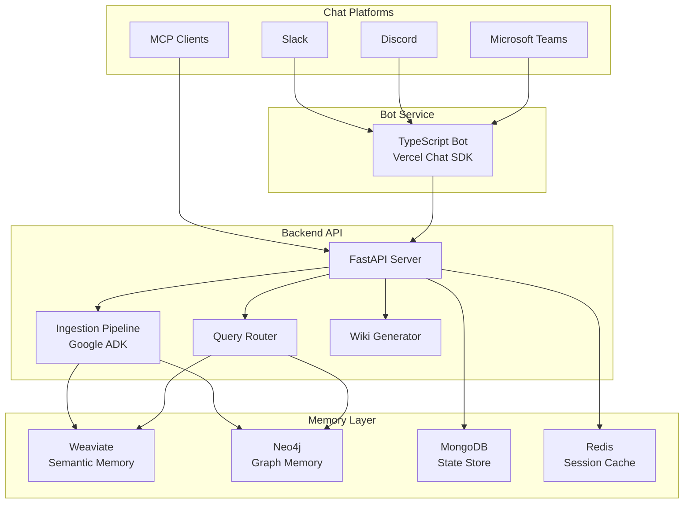

# Architecture Overview

Beever Atlas is built on a **dual-memory architecture** that combines semantic search with knowledge graphs to transform your team conversations into a persistent, queryable knowledge base. Unlike traditional chat search tools that only find messages, Beever Atlas understands relationships, tracks decisions, and auto-generates wiki pages.

## Why This Matters

Your team's most valuable knowledge is trapped in scattered conversations across Slack, Discord, and Teams. Traditional search tools can find messages, but they can't answer questions like:

- "Who decided to use JWT and why?"
- "What blocks the authentication migration?"
- "How did our deployment strategy evolve over the past year?"
- "What projects is Alice working on?"

Beever Atlas solves this by ingesting your conversations, extracting facts and relationships, and organizing them into two complementary memory systems that work together to provide context-rich answers.

## System Architecture

## Technology Stack

| Component | Technology | Purpose |
|-----------|------------|---------|
| **Bot Framework** | Vercel Chat SDK (TypeScript) | Real-time message capture from chat platforms |
| **Backend API** | FastAPI (Python) | REST API for queries and ingestion |
| **Agent Framework** | Google ADK | Orchestrates multi-stage ingestion and query pipeline |
| **Semantic Memory** | Weaviate | Vector search for facts, topics, and multimodal content |
| **Graph Memory** | Neo4j | Knowledge graph for entities, relationships, and temporal evolution |
| **State Management** | MongoDB | Sync state, outbox pattern, write intents |
| **Session Cache** | Redis | Chat SDK bot state and caching |
| **Embeddings** | Jina v4 (2048-dim) | Multimodal embeddings for text and images |
| **LLM** | Gemini 2.0 Flash + Claude fallback | Fact extraction, routing, and response generation |
| **External Search** | Tavily | Web search for best practices and documentation |

## Key Architecture Principles

### Dual-Memory Design

Beever Atlas uses two complementary memory systems:

- **Semantic Memory (Weaviate)**: Handles ~80% of queries — factual lookups, topical questions, and content retrieval. Uses a 3-tier hierarchy (Summary → Topic Clusters → Atomic Facts) for cost-optimized retrieval.

- **Graph Memory (Neo4j)**: Handles ~20% of queries — relational questions, temporal evolution, and multi-hop traversals. Captures entities (Person, Decision, Project, Technology) and their relationships.

These systems are **not redundant** — they each solve problems the other cannot. Weaviate can't traverse "Person → works on → Project → has decision → blocked by → Constraint." Neo4j can't do fuzzy semantic search across thousands of facts.

### Agent-Based Processing

The ingestion and query pipelines are orchestrated by **Google ADK agents** — specialized AI agents that handle specific stages:

- **Ingestion Pipeline**: 6-stage pipeline (Sync → Extract → Validate → Store → Cluster → Wiki) with parallel execution where possible
- **Query Router**: Decomposes complex questions, routes to appropriate memory systems, and merges results
- **Quality Gates**: Confidence-scored filtering prevents low-quality data from entering your knowledge base

### Cost-Optimized Retrieval

Beever Atlas is designed for cost efficiency at scale:

- **Tier 0 + Tier 1 reads = FREE**: Pre-generated channel summaries and topic clusters require no LLM calls
- **Tier 2 search = CHEAP**: ~$0.001 per query (embeddings only)
- **LLM synthesis = PAID**: ~$0.02 per query (only when needed)
- **Average query cost**: ~$0.01 (5x cheaper than competitors)

### Graceful Degradation

The system is built to handle component failures:

- **Circuit breakers** for each external dependency (Weaviate, Neo4j, Gemini, Jina, Tavily)
- **Fallback models**: If Gemini is unavailable, routes to Claude via LiteLLM
- **Partial degradation**: If Neo4j is down, semantic search still works; if embeddings fail, BM25-only search continues
- **Outbox pattern**: Cross-store writes are retryable and reconciled automatically

## Data Flow

### Ingestion Flow

1. **Sync**: Fetch messages from Slack/Discord/Teams via platform adapters
2. **Extract**: LLM extracts facts and entities in parallel
3. **Validate**: Quality gates filter low-confidence extractions
4. **Store**: Write to Weaviate (facts) and Neo4j (entities) via outbox pattern
5. **Cluster**: Group related facts into topic clusters
6. **Wiki**: Generate structured wiki pages from clusters

### Query Flow

1. **Decompose**: Complex questions split into focused sub-queries
2. **Understand**: LLM classifies query type (semantic/graph/both)
3. **Route**: Execute searches in appropriate memory systems
4. **Merge**: Combine results, apply temporal decay, deduplicate
5. **Respond**: Generate grounded answer with citations

## What Makes Beever Atlas Different

| Traditional Search | Beever Atlas |
|-------------------|--------------|
| Find messages by keyword | Understand relationships and context |
| No memory of past decisions | Tracks decision evolution over time |
| Can't connect related topics | Auto-groups facts into topic clusters |
| No wiki generation | Auto-generates and updates wiki pages |
| Expensive at scale | Cost-optimized with tiered retrieval |

## Next Steps

- Learn about the **[LLM Wiki Pattern](/docs/concepts/llm-wiki-pattern)** that powers persistent knowledge
- Understand the **[Dual Memory Architecture](/docs/concepts/dual-memory)** in detail
- See how the **[Ingestion Pipeline](/docs/concepts/ingestion-pipeline)** transforms messages into knowledge
- Explore how the **[Query Router](/docs/concepts/query-router)** decides the best way to answer questions
