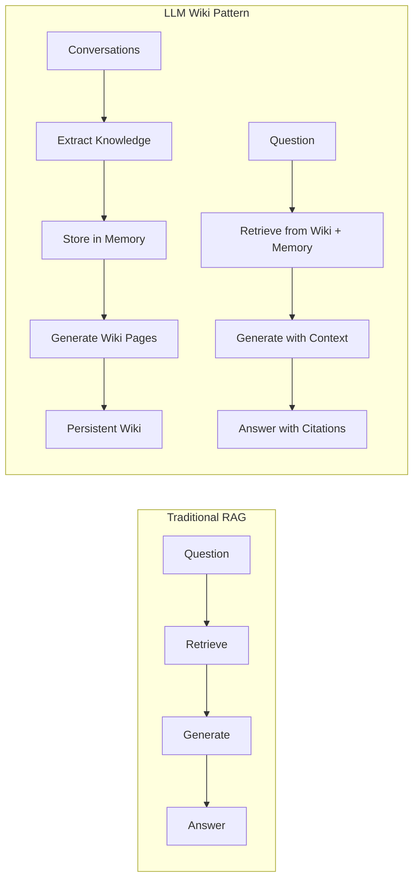

# The LLM Wiki Pattern

The **LLM Wiki pattern** — popularized by Andrej Karpathy — represents a fundamental shift in how teams capture and share knowledge. Instead of treating conversations as ephemeral and separate from documentation, this pattern treats conversations as the **primary source of truth** and uses AI to continuously extract, organize, and present that knowledge as a persistent wiki.

## Traditional RAG vs. LLM Wiki

Most AI-powered search tools use **RAG (Retrieval-Augmented Generation)**: you ask a question, the system searches for relevant messages, and an LLM synthesizes an answer. This is stateless — every query starts from scratch.

The **LLM Wiki pattern** is different:



| Aspect | Traditional RAG | LLM Wiki Pattern |
|--------|----------------|------------------|
| **Knowledge source** | Messages only | Conversations → structured knowledge → persistent wiki |
| **State** | Stateless (each query independent) | Stateful (wiki persists across sessions) |
| **Consistency** | Answers may vary each time | Consistent answers from stable wiki |
| **Browsing** | Can't browse knowledge | Browseable wiki with topics and hierarchies |
| **Evolution** | Can't track knowledge changes | Wiki shows how decisions evolved over time |
| **Cost** | LLM call on every query | Cached wiki = free reads; LLM only for updates |

## Three-Layer Architecture

Beever Atlas implements the LLM Wiki pattern through three layers:

### Layer 1: Raw Conversations

Your team's existing messages in Slack, Discord, and Teams. These are **never modified** — Beever Atlas reads from them but doesn't change them.

### Layer 2: Structured Memory

Beever Atlas processes conversations through the **ingestion pipeline**:

1. **Extract facts**: Atomic knowledge units from messages
2. **Extract entities**: People, decisions, projects, technologies
3. **Extract relationships**: How entities connect (decided, works on, blocked by)
4. **Quality filter**: Low-confidence extractions are rejected

This creates **two complementary memory systems**:

- **Semantic Memory (Weaviate)**: Facts organized by topic and searchable by meaning
- **Graph Memory (Neo4j)**: Entities and relationships traversable like a knowledge graph

### Layer 3: Persistent Wiki

The wiki layer is **auto-generated from structured memory**:

- **Channel summaries**: High-level overview of what's happening
- **Topic pages**: Grouped facts about specific themes (auth, deployment, API design)
- **Entity pages**: People, projects, decisions with their relationships
- **Cross-references**: Links between related topics and entities

The wiki is **incremental** — new conversations add to existing pages rather than replacing them.

## Why Persistent Wiki Matters

### Consistent Answers

Traditional RAG can give different answers to the same question because it re-synthesizes from scratch each time. The LLM Wiki pattern ensures consistency:

- "What's our auth strategy?" → Always gets the same wiki page
- Wiki pages show the **current state** with history
- Changes to wiki pages are tracked over time

### No Hallucination from Missing Context

RAG systems can hallucinate when retrieval misses relevant context. The wiki pattern reduces this:

- Wiki pages are **pre-generated** from all available context
- Missing context means gaps in the wiki, not made-up facts
- Citations link back to source messages for verification

### Browseable Knowledge

RAG is query-only — you can't explore the knowledge base. The wiki pattern enables browsing:

- Navigate from topics to subtopics to specific facts
- Follow relationships between entities (Alice → Project → Decision)
- Discover related knowledge you didn't know to ask for

### Temporal Evolution

Traditional systems can't show how knowledge changed over time. Beever Atlas tracks evolution:

- Decision supersession chains ("We used JWT, then switched to OAuth")
- Project status changes ("In progress" → "Blocked" → "Completed")
- Relationship evolution ("Alice worked on X, then moved to Y")

## How Beever Atlas Implements This Pattern

### Ingestion: Conversations → Memory

The 6-stage ingestion pipeline continuously processes new messages:

1. **Sync**: Fetch from chat platforms
2. **Extract**: LLM extracts facts + entities in parallel
3. **Validate**: Quality gates filter low-confidence extractions
4. **Store**: Write to Weaviate + Neo4j
5. **Cluster**: Group facts into topics
6. **Wiki**: Update wiki pages

### Wiki Generation: Memory → Wiki

Wiki pages are generated in three triggers:

1. **After sync**: Incremental updates when new messages arrive
2. **Daily rebuild**: Full reconsolidation for coherence and split/merge
3. **On-demand**: Manual refresh for admins

Wiki structure mirrors the memory hierarchy:

```
Channel
├── Overview (from Tier 0 summary)
├── Topics (from Tier 1 clusters)
│   ├── Authentication
│   │   ├── Facts
│   │   ├── Related Decisions
│   │   └── People Involved
│   └── Deployment
│       ├── Facts
│       └── Related Projects
└── Entities (from Neo4j)
    ├── People
    ├── Decisions
    └── Projects
```

### Query: Wiki + Memory → Answers

When you ask a question, Beever Atlas:

1. Checks wiki for cached answers (free)
2. Searches semantic memory for relevant facts (cheap)
3. Traverses graph memory for relationships (if needed)
4. Merges results and generates grounded answer with citations

The wiki provides **fast, consistent answers** for common questions. Memory provides **detailed, contextual answers** for specific queries.

## Benefits for Your Team

### No Manual Documentation Required

Your team already documents everything — in chat. Beever Atlas captures this knowledge automatically without requiring:

- Manual wiki editing
- Meeting notes
- Documentation sprints
- Knowledge management overhead

### Always Up-to-Date

Traditional wikis stale quickly because no one updates them. Beever Atlas:

- Auto-updates as conversations happen
- Shows recent activity on each page
- Tracks when knowledge changed

### Reduces Question Repetition

Common questions get answered once and cached:

- "What's our API auth approach?" → Wiki page with full answer
- "Who's working on the migration?" → Entity page with current assignments
- "Why did we choose PostgreSQL?" → Decision page with rationale

New team members can self-serve answers instead of asking repeatedly.

### Captures Tacit Knowledge

Much team knowledge is never formally documented:

- War stories from past incidents
- Rationale behind past decisions
- Unwritten conventions and heuristics
- Relationship context ("Alice knows about X")

The graph memory captures this through entity relationships that aren't explicitly stated.

## Comparison to Traditional Approaches

| Confluence/Notion | Beever Atlas |
|-------------------|--------------|
| Manual editing required | Auto-generated from chat |
| Stales quickly | Always up-to-date |
| Search finds pages | Search finds answers + context |
| No relationship tracking | Graph shows how entities connect |
| No temporal tracking | Shows how knowledge evolved |
| High maintenance overhead | Zero maintenance |

| Standard RAG | Beever Atlas |
|--------------|--------------|
| Stateless answers | Persistent wiki |
| Inconsistent answers | Consistent cached answers |
| Can't browse knowledge | Browseable wiki |
| No temporal awareness | Tracks evolution over time |
| Expensive at scale | Cost-optimized with caching |

## Next Steps

- See the **[Dual Memory Architecture](/docs/concepts/dual-memory)** that enables this pattern
- Learn about the **[Ingestion Pipeline](/docs/concepts/ingestion-pipeline)** that transforms conversations into knowledge
- Understand **[Wiki Generation](/docs/concepts/wiki-generation)** in detail
