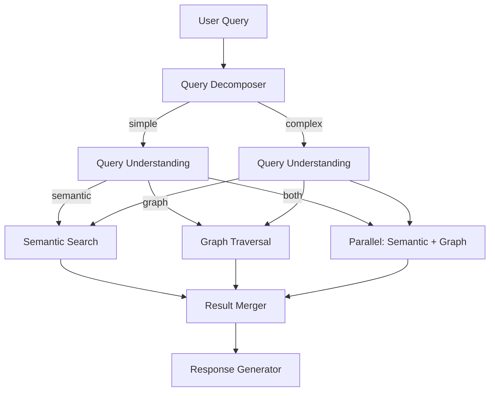

# Query Router

When you ask a question, the Query Router decides the best way to answer it. It classifies your question, routes it to the appropriate memory systems (semantic, graph, or both), and merges the results into a comprehensive answer with citations.

## How Query Routing Works



## Step 1: Query Decomposition

Complex questions are decomposed into focused parallel sub-queries:

**Simple questions** → Single internal query, no decomposition
- "What was discussed about auth?"
- "Who decided to use JWT?"

**Complex questions** → 2-4 internal + 0-2 external sub-queries
- "What auth method did we decide on and how does it compare to best practices?"
  - Internal: "authentication decision JWT"
  - Internal: "OAuth implementation alice"
  - External: "JWT vs OAuth best practices 2025"

Decomposition enables parallel execution across all sub-queries.

## Step 2: Query Understanding

An LLM classifies each sub-query for routing:

**Classification**:
- `route`: semantic | graph | both
- `semantic_depth`: overview | topic | detail
- `entities`: Named entities mentioned
- `topics`: Topic areas referenced
- `temporal_scope`: recent | any | historical
- `confidence`: 0.0-1.0

**Cost**: ~$0.001 per query (Gemini Flash Lite)

## Step 3: Routing Strategy

The router selects the optimal strategy based on classification:

### Semantic-Only Queries

**Route when**: Looking for facts, discussions, topics, documents

**Examples**:
- "What was discussed about auth?" → Semantic search
- "Find deployment docs" → Cross-modal search (find PDFs)
- "Show me the overview" → Tier 0 cached summary (FREE)
- "Tell me about deployment" → Tier 1 topic cluster (FREE)

**How it works**:
- Route to Weaviate based on semantic_depth
- overview → Tier 0 summary
- topic → Tier 1 clusters → Tier 2 atomics
- detail → Tier 2 atomics directly
- Hybrid BM25+vector search for optimal relevance

**Cost**: $0.001 (FREE for Tier 0/1)
**Latency**: < 200ms (FREE reads: < 50ms)

### Graph-Only Queries

**Route when**: Looking for entity relationships, people, decisions, temporal changes

**Examples**:
- "Who decided to use JWT?" → Person → Decision traversal
- "What is Alice working on?" → Person → Project traversal
- "How did the auth approach evolve?" → Decision temporal chain
- "What blocks the migration?" → Project → BLOCKED_BY traversal

**How it works**:
1. Resolve entities from query to Neo4j nodes
2. Graph traversal (1-2 hops)
3. Follow episodic edges → Weaviate IDs
4. Fetch full memories from Weaviate
5. Combine graph structure + memory content

**Cost**: $0.005
**Latency**: ~500ms

### Both (Parallel) Queries

**Route when**: Could benefit from both fact retrieval AND relationship context

**Examples**:
- "Tell me about the JWT migration" → Needs facts + decisions + people
- "What happened with auth last week?" → Temporal + factual
- Low-confidence classifications → Use both for coverage

**How it works**:
1. Execute semantic search and graph traversal in parallel
2. Merge results:
   - Deduplicate by weaviate_id
   - Boost cross-validated results (mentioned in both)
   - Apply temporal decay
   - Quality-score weighted ranking
3. Generate response from merged context

**Cost**: $0.006
**Latency**: ~500ms (parallel execution)

## Routing Decision Table

| Query Pattern | Route | Why | Cost | Latency |
|---|---|---|---|---|
| "What was discussed about auth?" | Semantic | Factual lookup | $0.001 | `< 200ms` |
| "Show me the overview" | Semantic (Tier 0) | Cached summary | FREE | < 50ms |
| "Tell me about deployment" | Semantic (Tier 1) | Topic cluster | FREE | < 50ms |
| "Find the architecture diagram" | Semantic (cross-modal) | Image search | $0.001 | `< 200ms` |
| "Who decided to use JWT?" | Graph | Person→Decision traversal | $0.005 | ~500ms |
| "What is Alice working on?" | Graph | Person→Project traversal | $0.005 | ~500ms |
| "How did the auth approach evolve?" | Graph (temporal) | Decision→SUPERSEDES chain | $0.005 | ~500ms |
| "What blocks the migration?" | Graph | Project→BLOCKED_BY traversal | $0.005 | ~500ms |
| "Tell me about the JWT migration" | Both (parallel) | Facts + relationships | $0.006 | ~500ms |
| "What happened with auth last week?" | Both (parallel) | Temporal + factual | $0.006 | ~500ms |

## Step 4: Result Merging

When both memory systems are used, results are merged:

### Deduplication
- Remove duplicates by weaviate_id
- Same fact may appear in both systems

### Cross-Validation Boost
- Facts mentioned in both systems score higher
- Indicates strong relevance and confidence

### Temporal Decay
- Older facts gradually score lower
- Exemptions for high-importance facts
- Slower decay for decisions/architecture

### Quality-Weighted Ranking
- Higher-quality facts score higher
- Quality score assigned at extraction

## Step 5: Response Generation

The final response is generated with:

### Citations
- Every fact linked to source message
- Slack/Discord/Teams message URL
- Timestamp and author

### Confidence Scoring
- Response confidence based on:
  - Query understanding confidence
  - Result relevance scores
  - Cross-validation presence

### Fallback Handling
- **No results**: Suggest query refinement
- **Low confidence**: Indicate uncertainty
- **Graph timeout**: Fall back to semantic-only
- **External search failure**: Return internal-only results

## External Search Integration

For questions requiring web knowledge (best practices, documentation, industry comparisons), the router adds external sub-queries:

**Examples**:
- "How does our JWT implementation compare to OWASP guidelines?"
- "What are the best practices for token rotation?"
- "Show me Django REST framework documentation"

**How it works**:
1. Query decomposer generates external_queries
2. Execute via Tavily API in parallel with internal queries
3. Merge external results with internal knowledge
4. Generate response comparing internal vs external

**Cost**: 1 Tavily credit per external query (1,000 free/month)

**Config**:
```bash
TAVILY_API_KEY=required
ENABLE_EXTERNAL_SEARCH=true
TAVILY_SEARCH_DEPTH=basic  # or advanced (2 credits)
TAVILY_MAX_RESULTS=5
```

## Query Examples

### Example 1: Simple Semantic Query

**Question**: "What was discussed about authentication?"

1. **Decomposition**: Single internal query (simple)
2. **Understanding**: route=semantic, depth=topic, confidence=0.9
3. **Routing**: Tier 1 topic clusters → Tier 2 atomics
4. **Retrieval**: 15 facts from "authentication" cluster
5. **Response**: "The team discussed JWT vs OAuth, decided on JWT with RS256, Alice is implementing next sprint..."

### Example 2: Graph Traversal Query

**Question**: "Who decided to use JWT and what blocks the implementation?"

1. **Decomposition**: Single internal query (simple)
2. **Understanding**: route=graph, entities=["JWT"], confidence=0.8
3. **Routing**: Graph traversal
4. **Traversal**:
   - "JWT" decision node
   - Follow DECIDED_BY → Person (Alice)
   - Follow BLOCKED_BY → Constraint (missing refresh token rotation)
5. **Enrichment**: Fetch decision text from Weaviate
6. **Response**: "Alice decided on JWT (citation). The implementation is blocked by missing refresh token rotation (citation)."

### Example 3: Complex Parallel Query

**Question**: "Tell me about the authentication migration and how it compares to best practices"

1. **Decomposition**:
   - Internal: "authentication migration JWT"
   - Internal: "OAuth implementation alice"
   - External: "JWT vs OAuth best practices 2025"
2. **Understanding**: route=both, confidence=0.7
3. **Routing**: Parallel execution
   - Semantic: Find migration facts
   - Graph: Traverse decision relationships
   - External: Search Tavily for best practices
4. **Merge**: Combine internal knowledge + external comparison
5. **Response**: "Our migration from OAuth to JWT (internal)... Compared to OWASP guidelines, we're following best practices for X but should improve Y (external)..."

## Cost Optimization

The router is designed for cost efficiency:

| Strategy | Cost | When Used |
|----------|------|-----------|
| Tier 0 cached | FREE | Overview queries |
| Tier 1 cached | FREE | Topic queries |
| Tier 2 search | $0.001 | Specific facts |
| Graph traversal | $0.005 | Relationship queries |
| Both parallel | $0.006 | Complex queries |
| LLM synthesis | $0.02 | Response generation |
| **Average** | **~$0.01** | **Typical query** |

**80% of queries are FREE or `<$0.001`** (Tier 0/1 or Tier 2 only)

## Next Steps

- Learn about the **[Dual Memory Architecture](/docs/concepts/dual-memory)** that the router accesses
- See **[Agent Architecture](/docs/concepts/agent-architecture)** that implements the router
- Understand **[Resilience](/docs/concepts/resilience)** features when components fail
