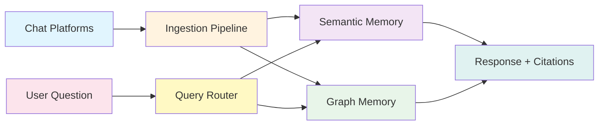

# How Beever Atlas Works

Beever Atlas transforms team conversations into an intelligent knowledge base through a multi-stage pipeline and dual-memory architecture.

## The LLM Wiki Pattern

Traditional wikis require manual curation. Search tools only retrieve existing content. Beever Atlas combines both approaches:

1. **Continuous ingestion** of team messages
2. **LLM-powered extraction** of facts and entities
3. **Automatic organization** into topic clusters
4. **Persistent wiki pages** that stay up-to-date
5. **Natural language queries** with cited sources

The result: A living knowledge base that grows with your team.

## Architecture Overview

## Ingestion Pipeline

Atlas uses a **6-stage pipeline** built on Google ADK's SequentialAgent framework:

### Stage 1: Preprocessor

Normalizes messages from different platforms:

- Convert Slack mrkdwn to Markdown
- Assemble threaded conversations
- Extract media attachments (images, PDFs via Gemini Vision)
- Filter bot messages and system notifications

### Stage 2: Fact Extractor

Uses Gemini 2.5 Flash to extract atomic facts:

- Quality gate: Score ≥ 0.5
- Maximum 2 facts per message
- Preserves temporal context and attribution

**Example fact**: *"On 2024-03-15, Alice decided to use RS256 for JWT signatures due to better security properties."*

### Stage 3: Entity Extractor

Identifies entities and relationships:

- Entities: People, decisions, projects, technologies
- Quality gate: Confidence ≥ 0.6
- Alias deduplication (e.g., "Alice" and "Alice Smith")
- Temporal validity tracking

### Stage 4: Embedder

Generates embeddings using Jina v4:

- 2048-dimensional vectors
- Named vectors for different content types
- Multimodal support (text, images)

### Stage 5: Cross-Batch Validator

Ensures consistency across batches:

- Resolve entity aliases globally
- Validate relationship consistency
- Detect and merge duplicate entities

### Stage 6: Persister

Writes to all three stores atomically:

- **Weaviate**: Facts with embeddings
- **Neo4j**: Entities and relationships
- **MongoDB**: State and wiki cache

Uses the **outbox pattern** for cross-store consistency.

<Callout type="info">
**Batch API Mode**: For large channels, Atlas can use Gemini's Batch API for asynchronous extraction, ideal for initial syncs of thousands of messages.
</Callout>

## Dual-Memory Architecture

### Semantic Memory (Weaviate)

Stores **atomic facts** in a 3-tier hierarchy:

1. **Summaries**: Channel-level overviews
2. **Topics**: Clustered groups of related facts
3. **Facts**: Individual extracted knowledge

**Query method**: Hybrid BM25 + vector search with Jina embeddings

**Answers questions like**:
- "What was discussed about JWT authentication?"
- "Show me the database migration topic"
- "What are the recent decisions about the API?"

**Performance**: < 200ms latency

Handles ~80% of queries.

### Graph Memory (Neo4j)

Stores **entities and relationships**:

- **Entity types**: Person, Decision, Project, Technology
- **Relationships**: DECIDED_BY, WORKS_ON, USES, MENTIONED_IN
- **Temporal evolution**: Track changes over time

**Query method**: Cypher graph traversals

**Answers questions like**:
- "Who decided on RS256 for JWT signing?"
- "What projects is Alice working on?"
- "What technologies are used in Project X?"

**Performance**: 200ms – 1s latency

Handles ~20% of queries (relationship-heavy queries).

### Bidirectional Linking

Every fact in Weaviate stores `graph_entity_ids`, and every entity in Neo4j has a `MENTIONED_IN` edge to its source facts. This enables hybrid queries that traverse both stores.

## Query Router

When you ask a question, Atlas's LLM-powered router analyzes the query type:

1. **Semantic queries** → Weaviate (fast vector search)
2. **Relationship queries** → Neo4j (graph traversal)
3. **Hybrid queries** → Both stores, merged results

The router optimizes for:
- **Cost**: Minimize LLM calls
- **Latency**: Use faster semantic route when possible
- **Accuracy**: Graph route for complex relationships

## Wiki Generation

After ingestion, Atlas builds a structured wiki:

1. **Consolidation**: Facts are clustered using cosine similarity (no LLM cost)
2. **Topic Summarization**: LLM generates summaries for each cluster
3. **Wiki Compilation**: Queries both stores to generate 10+ page types
4. **Caching**: Full wiki stored in MongoDB for instant retrieval

A `wiki_dirty` flag triggers regeneration when new data arrives.

### Wiki Page Types

- **Overview**: Channel summary and key topics
- **Topics**: Hierarchical topic pages with sub-topics
- **People**: Team members and their contributions
- **Decisions**: Track decisions with context and outcomes
- **Tech Stack**: Technologies and tools used
- **Projects**: Active projects and status
- **Recent Activity**: Timeline of recent discussions
- **FAQ**: Frequently asked questions and answers
- **Glossary**: Domain-specific terms and definitions
- **Resources**: Links and references

## Streaming Q&A

When you ask a question via the web UI or API, Atlas streams the response:

1. **Thinking**: Agent reasoning trace
2. **Tool calls**: Each store query as it happens
3. **Response**: Answer tokens streamed in real-time
4. **Citations**: Source messages with permalinks
5. **Metadata**: Route used, cost, confidence score

<Callout type="success">
**Zero-cost wiki reads**: Wiki pages are cached in MongoDB, so reading your wiki incurs no LLM costs. LLMs are only used for ingestion and Q&A.
</Callout>

## What's Next?

- [Quick Start](./quick-start) — Try Atlas in 5 minutes with mock mode
- [Installation](./installation) — Set up your own instance
- [Platform Setup](./slack-setup) — Connect your real team data
